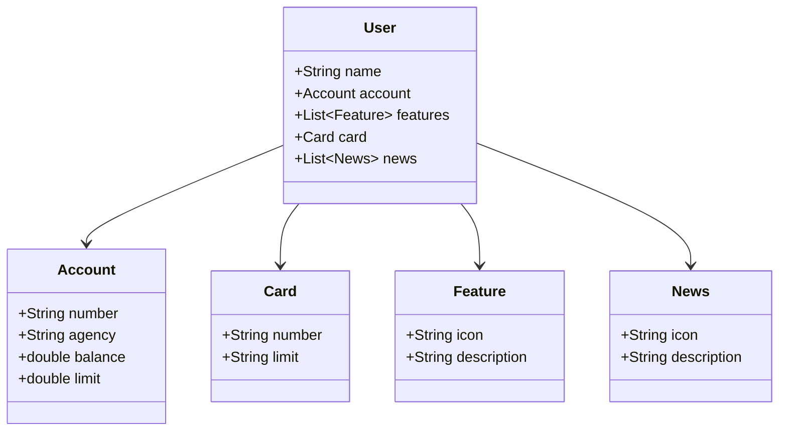

# RESTful API com Java

Este projeto é uma API RESTful desenvolvida em Java, com foco em boas práticas, estrutura limpa e extensível. Ideal para estudos, testes ou como base para aplicações mais robustas.

---

## Diagrama de Classes

---

## 📦 Tecnologias utilizadas

- **Java 17+**
- **Spring Boot** 
- **Gradle**
- **Lombok**
- **JPA / Hibernate**
- **Banco de Dados:** H2, PostgreSQL
- **Postman** (para testes de endpoints)
